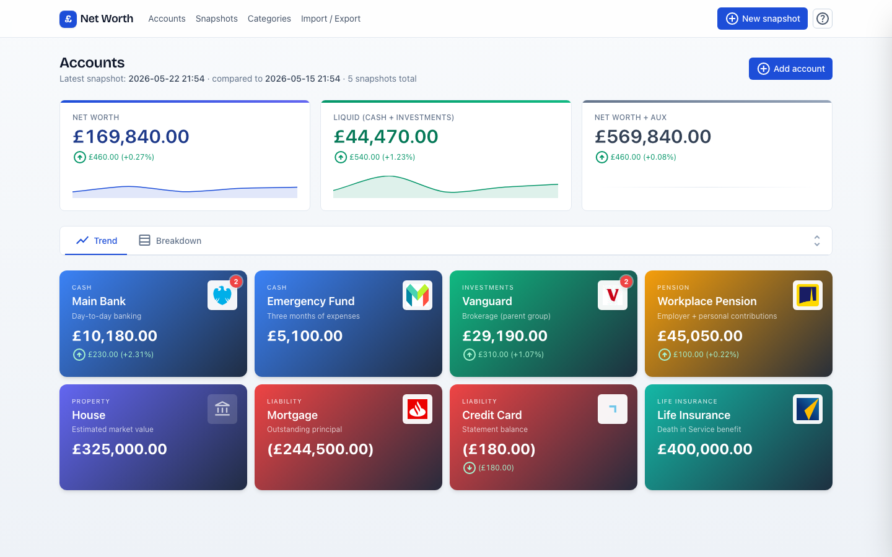
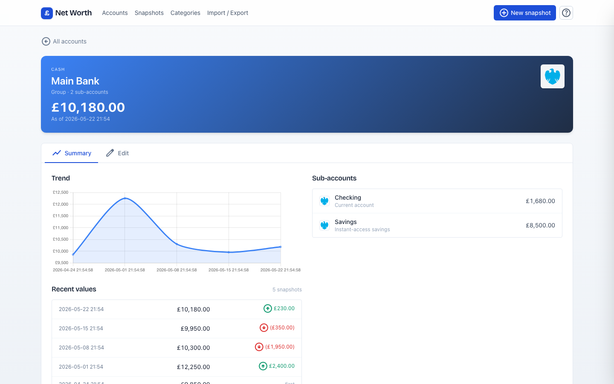
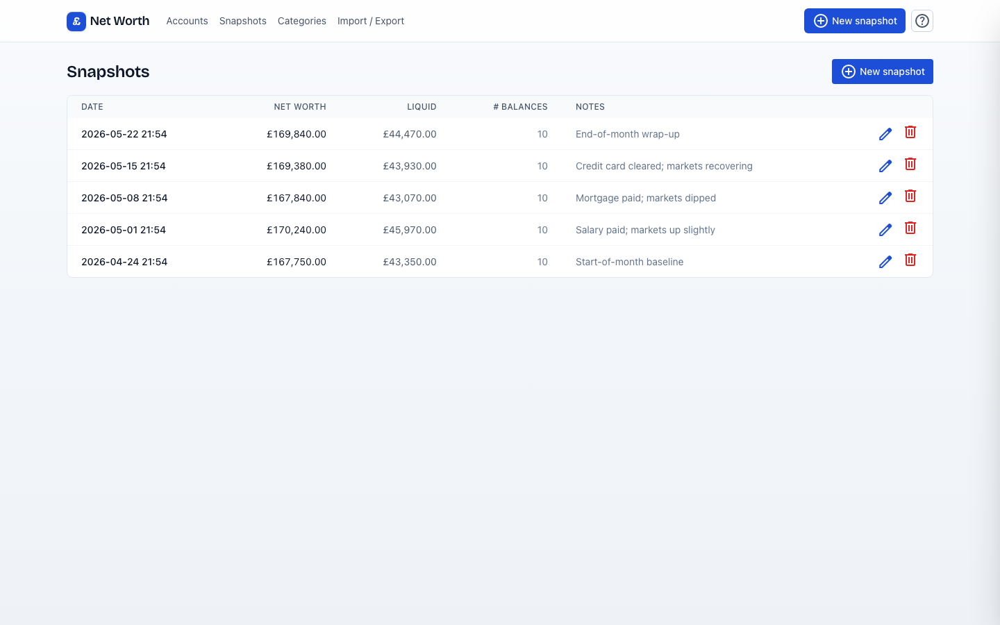

# Net Worth Tracker

Self-hosted personal net-worth tracker. FastAPI + HTMX + Tailwind + SQLite, packaged for Docker Compose.

## What it does

Track balances across accounts at any cadence — weekly, daily, multiple times a day. Each snapshot stores per-account balances at a point in time, with both date and time so intra-day captures are unambiguous.

The Accounts page is the home view: headline cards (Net Worth / Liquid / Net Worth + Aux) with per-card sparklines and period-over-period deltas, a collapsible tabbed insight widget (Trend chart + allocation doughnut on one tab; hierarchical category breakdown with deltas on the other), and a card grid of every top-level account — each card showing its current balance, change since the previous snapshot, and a red badge on group cards indicating sub-account count. Accounts can be organised into groups — e.g. all the sub-pots of a single bank account under one parent — so this page and the snapshot entry form mirror how you actually think about your money.

Clicking any account card opens its detail page with two tabs: **Summary** (trend chart, recent values, sub-accounts for groups) and **Edit** (account fields, institution domain for the logo, delete). Saving, deleting, or creating any account / category / snapshot shows a toast confirmation in the bottom-right.

CSV import / export is built in for backfilling history and round-tripping to spreadsheets. An in-app help panel (the "?" button in the top-right) walks first-time users through the workflow; the content lives in `app/help.yaml` and can be edited without touching code.

No authentication — designed to sit on a LAN or behind your existing reverse-proxy auth (Authelia, Tailscale, etc.).

## Quick start

```bash
cd networth-app
docker compose up -d --build
docker compose logs -f networth
```

Then open <http://localhost:8000>. The "?" button in the top-right opens an in-app guide that explains the workflow in a few minutes.

First-run behaviour: SQLite DB is created at `./data/networth.db`, Alembic migrations run, and the schema is seeded with 7 starter categories (Cash, Investments, Restricted, Pension, Property, Liability, Life Insurance). No accounts or balances — head to the Accounts page to add your own, then "+ New snapshot" to enter your first set.

## Try a demo

Want to see what a populated home page looks like before adding your own accounts? Seed a separate `data/demo.db` with realistic accounts and a month of weekly snapshots. The script always writes to its own file — it never reads `DATABASE_URL` and can't clobber your real data.

```bash
# In Docker:
docker compose exec networth python -m app.demo_seed

# Locally:
python -m app.demo_seed
```

This creates 10 leaf accounts under 2 groups (Cash / Investments / Pension / Property / Liability / Life Insurance) and 5 weekly snapshots spanning ~28 days, with realistic moves: salary deposit, mortgage payment, market dip and recovery, credit card paid off. Re-run with `--reset` to wipe and re-seed; pass `--db /some/path.db` to seed elsewhere.

To view it, point the app at the demo DB (your real `networth.db` is untouched):

```bash
# In Docker (set in an .env file alongside docker-compose.yml, or override at the CLI):
DATABASE_URL=sqlite:////data/demo.db docker compose up

# Locally:
DATABASE_URL='sqlite:///./data/demo.db' uvicorn app.main:app
```

Screenshots from the demo dataset:


*Home: three headline cards with sparklines and deltas, a collapsible Trend / Breakdown insight widget, and a card grid of every top-level account showing per-card deltas (red badge on group cards = sub-account count).*


*Account detail (clicking the Main Bank card): hero summary with logo, then a Summary / Edit tab pair. Summary shows trend chart, scrollable recent values, and (for groups) sub-accounts.*


*Snapshots list: every recorded point in time with notes, per-snapshot Net Worth / Liquid totals, and icon-only edit / delete actions per row.*

## Configuration

Set via `docker-compose.yml` or a `.env` file alongside it:

- `PORT` — host port to expose (default `8000`)
- `TZ` — timezone for log timestamps (default `Europe/London`)
- `DATABASE_URL` — SQLAlchemy URL; defaults to `sqlite:////data/networth.db`

## Local development (without Docker)

```bash
python -m venv .venv && source .venv/bin/activate
pip install -r requirements.txt
npm install
npm run build:css          # produces app/static/app.css
DATABASE_URL=sqlite:///$(pwd)/dev.db uvicorn app.main:app --reload
```

`npm run watch:css` rebuilds the CSS file on template edits.

In-app help is context-aware — each page (Accounts, Snapshots, Categories, etc.) gets its own set of sections, plus a shared "General" block that appears on every view. Content lives in `app/help.yaml`:

```yaml
views:
  home:
    title: Accounts            # rendered as "Help · Accounts" in the panel header
    sections:
      - id: home-headlines
        title: Headline cards
        body: |
          <p>HTML body — write whatever's easiest to author.</p>

global:
  - id: glb-concepts
    title: Key concepts
    body: |
      <p>This section is appended to every view.</p>
```

Reorder, add, or delete sections freely; restart the app to pick up changes. To add help for a new view, give that route a `view_id="<name>"` in `app/main.py` and add a `views.<name>` entry to the YAML.

Note: if you reference Tailwind utility classes inside YAML bodies (e.g. `class="list-disc pl-5"`), they get picked up because `tailwind.config.js` includes `app/help.yaml` in its `content` paths. Rebuild CSS (`npm run build:css` locally, or rebuild the Docker image) after adding utility classes.

## Data and backups

The SQLite file lives at `./data/networth.db` on the host (bind-mounted into the container). Back it up however you back up the rest of the host. While the app is running, prefer:

```bash
sqlite3 ./data/networth.db ".backup '/path/to/backup.db'"
```

over a raw file copy to guarantee a consistent snapshot.

To wipe everything and start fresh: stop the container, delete `./data/networth.db`, restart. Seed runs again.

## Migrations

The app uses Alembic. On startup it auto-runs `alembic upgrade head`. Existing installs that pre-date Alembic (had tables but no `alembic_version` row) are auto-stamped to the initial revision before upgrading — no manual intervention needed.

Current migrations:

- `0001` — initial schema (categories, accounts, snapshots, balances)
- `0002` — adds `parent_id` and `is_group` to accounts (account grouping)
- `0003` — `snapshot_date` becomes `DateTime` and drops the unique constraint (multiple snapshots per day allowed)
- `0004` — adds `institution_domain` and `logo_url` columns to accounts (institution logos)
- `0005` — adds hot-path indexes on `snapshots.snapshot_date` and `balances.account_id`

To create a new migration after a model change:

```bash
docker compose exec networth alembic revision --autogenerate -m "describe change"
# edit alembic/versions/NEW_FILE.py to verify the autogen
docker compose restart networth
```

## Routes

- `/` — Accounts home (headlines + sparklines, deltas, collapsible Trend / Breakdown widget, card grid)
- `/accounts/new` — add account
- `/accounts/{id}` — account detail (Summary + Edit tabs, delete)
- `/snapshots` — list, edit, delete
- `/snapshots/new` — new snapshot (date defaults to right-now, balances pre-filled from previous snapshot)
- `/categories` — inline edit + add (with color swatches alongside a native picker)
- `/import` — CSV import / export
- `/export` — direct CSV download
- `/api/chart-data?period=weekly|monthly|quarterly` — JSON for the trend chart
- `/healthz` — container health check

Errors are content-negotiated: browsers get a styled HTML error page with Back / Home buttons; clients sending `Accept: application/json` (or hitting any `/api/*` endpoint) get JSON. Successful mutations (save / create / delete) redirect with a `?toast=...&kind=success` query param that `base.html` renders as a bottom-right toast and then strips from the URL via `history.replaceState`.

## Stack

- **FastAPI** — web framework
- **SQLAlchemy 2.0** + **Alembic** — ORM and migrations
- **SQLite** — single-file database (sized for hundreds of years of weekly snapshots)
- **Jinja2** — server-rendered templates (with shared macros in `app/templates/partials/`)
- **HTMX** — light interactivity without an SPA
- **Tailwind CSS** (built at image-build time, no runtime CDN) — styling, plus a small CSS-variable design-token layer in `app/static/src.css`
- **Chart.js** — line + doughnut charts (trend, allocation, headline sparklines, account-detail sparkline)
- **Material Symbols Outlined** (Google Fonts, filtered to the ~16 icons actually used) — UI iconography
- **Bricolage Grotesque** (Google Fonts) — display font for headings and the `£` wordmark
- **PyYAML** — loads in-app help content from `app/help.yaml`

Total Python deps: 7. Runs comfortably in <100 MB of RAM.
